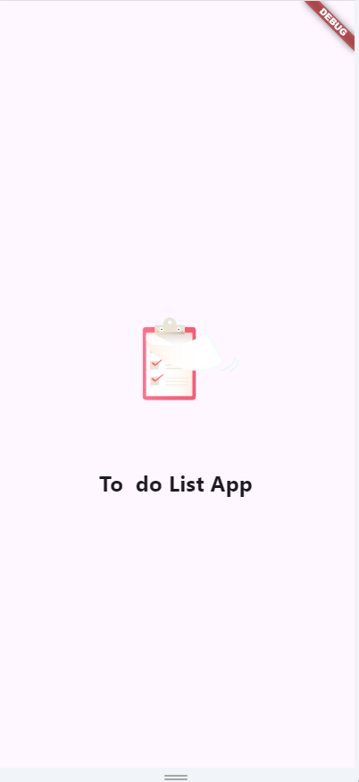
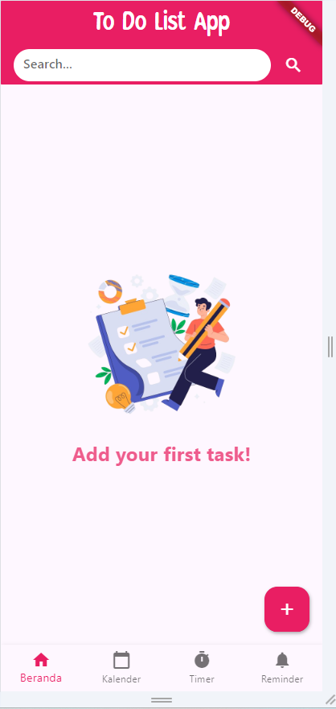
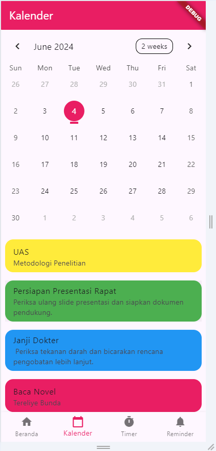
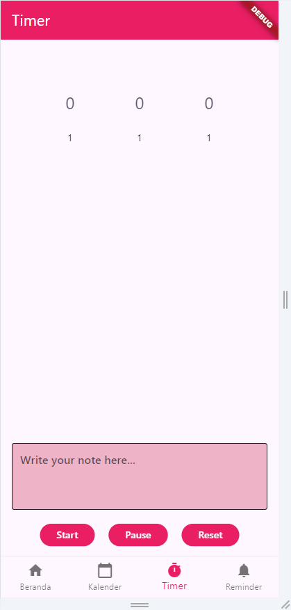

# To Do List App

Aplikasi ini adalah sebuah aplikasi manajemen tugas yang memungkinkan pengguna untuk membuat, mengedit, dan menghapus tugas, serta mengatur waktu pengerjaan dengan fitur timer. Selain itu, pengguna juga dapat melihat kemajuan pengerjaan tugas melalui fitur remainder. Dengan aplikasi ini, pengguna dapat lebih terorganisir dalam mengelola aktivitas sehari-hari.

## UI/UX To Do List App

